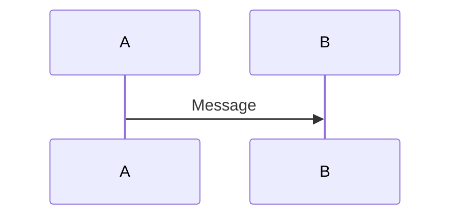
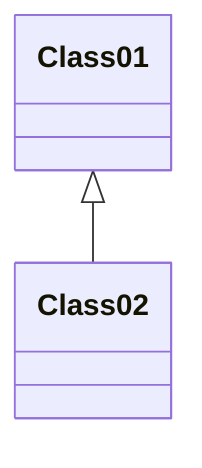
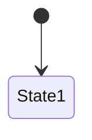

# Image Guide for KP Manoj Tech Trends

## Current Status

✅ **Article cards now support images!**
- Colorful category-specific gradients with emojis as placeholders
- Each category has its own unique gradient and icon
- Cards have hover effects and animations

## How to Add Real Images

### Option 1: Add Images to Public Folder

1. **Create images folder**:
   ```
   public/images/articles/
   ```

2. **Add images** (recommended size: 1200x630px):
   ```
   public/images/articles/scaling-agentic-ai.jpg
   public/images/articles/multilevel-agent-stack.jpg
   etc...
   ```

3. **Update article data** in `data/articles/[article-name].js`:
   ```javascript
   export const article = {
     // ... other fields
     image: '/images/articles/scaling-agentic-ai.jpg',
   }
   ```

### Option 2: Use Unsplash (Free Stock Photos)

Add this to article:
```javascript
image: 'https://images.unsplash.com/photo-[ID]?w=1200&h=630&fit=crop',
```

**Recommended Unsplash searches for your topics**:
- "artificial intelligence" - https://unsplash.com/s/photos/artificial-intelligence
- "network architecture" - https://unsplash.com/s/photos/network-architecture
- "data center" - https://unsplash.com/s/photos/data-center
- "robot technology" - https://unsplash.com/s/photos/robot-technology
- "cloud computing" - https://unsplash.com/s/photos/cloud-computing
- "digital network" - https://unsplash.com/s/photos/digital-network

### Option 3: Generate with AI (Midjourney/DALL-E)

**Prompt examples**:
```
1. "Professional tech diagram showing AI agent architecture, modern, clean, blue and purple gradient"
2. "Abstract visualization of multi-agent systems communicating, digital art, futuristic"
3. "Enterprise infrastructure with AI nodes, isometric view, professional"
4. "Swarm intelligence visualization, connected nodes, network diagram, modern tech aesthetic"
```

## Current Category Gradients & Icons

| Category | Gradient | Icon |
|----------|----------|------|
| Agentic AI | Purple → Pink → Red | 🤖 |
| Artificial Intelligence | Blue → Cyan → Teal | 🧠 |
| Business Innovation | Green → Emerald → Cyan | 💡 |
| Cloud Computing | Sky → Blue → Indigo | ☁️ |
| Machine Learning | Violet → Purple → Fuchsia | 📊 |
| Software Architecture | Orange → Red → Pink | 🏗️ |
| Enterprise AI | Indigo → Blue → Cyan | 🏢 |
| AI Operations | Teal → Green → Lime | ⚙️ |
| Infrastructure | Slate → Gray → Zinc | 🔧 |
| AI Architecture | Rose → Pink → Fuchsia | 🎯 |

## Diagrams Added

The following articles now include Mermaid diagrams:

1. **Scaling Agentic AI Architecture** - System architecture diagram
2. **Multilevel Agent Stack** - Layer architecture
3. **Single Agent to Swarm** - Swarm communication diagram
4. **Multi-Agent Orchestration** - Sequence diagram

## To Add More Diagrams

Edit the article content in `data/articles/[article-name].js` and add Mermaid syntax:

```javascript
content: `Your article text...

## Diagram Title

\`\`\`mermaid
graph TD
    A[Start] --> B[Process]
    B --> C[End]
\`\`\`

More article text...`
```

### Mermaid Diagram Types

**Flowchart**:


**Sequence Diagram**:


**Class Diagram**:


**State Diagram**:


## Recommended Image Services

### Free Options:
1. **Unsplash** - https://unsplash.com (Free, high quality)
2. **Pexels** - https://pexels.com (Free, good variety)
3. **Pixabay** - https://pixabay.com (Free, royalty-free)

### AI Generation:
1. **DALL-E 3** (ChatGPT Plus)
2. **Midjourney** ($10/month)
3. **Stable Diffusion** (Free, self-hosted)
4. **Leonardo.ai** (Free tier available)

### Stock Photo Paid:
1. **Adobe Stock** - Professional quality
2. **Shutterstock** - Large library
3. **Getty Images** - Premium content

## Best Practices

1. **Consistency**: Use similar style across all images
2. **Size**: 1200x630px (ideal for social sharing)
3. **Format**: WebP for best performance, fallback to JPG
4. **Alt Text**: Always descriptive
5. **File Size**: Keep under 200KB per image
6. **Colors**: Match your brand (blues, purples)

## Quick Win: Use Placeholders Now

Current gradients look professional! You can:
- Launch with current gradient placeholders
- Add real images gradually
- A/B test which converts better

Gradient placeholders are actually trending in modern web design!

---

**Need help adding images? Let me know and I can guide you through the process!**

